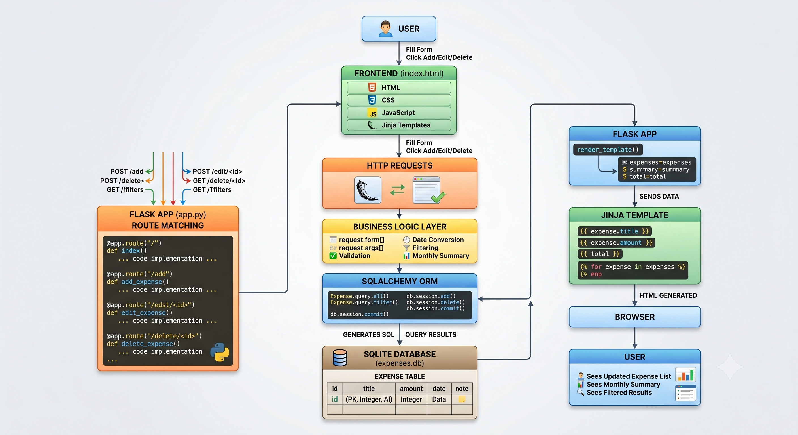

# Expense Tracker

A simple web-based Expense Tracker built with Flask and SQLite. The application allows users to add, edit, delete, search, and filter expenses while viewing a monthly spending summary.

---

## How to Run

### 1. Clone the Repository

```bash
git clone https://github.com/ZAKPRO786/expense-tracker.git
cd expense-tracker
```

### 2. Create a Virtual Environment

```bash
python -m venv venv
```

### 3. Activate the Virtual Environment

Windows:

```bash
venv\Scripts\activate
```

Linux/macOS:

```bash
source venv/bin/activate
```

### 4. Install Dependencies

```bash
pip install -r requirements.txt
```

### 5. Run the Application

```bash
python app.py
```

### 6. Open in Browser

```text
http://127.0.0.1:5000
```

---

## Stack Choices

### Backend

* Flask
* SQLAlchemy ORM

### Database

* SQLite

### Frontend

* HTML
* CSS
* JavaScript

---

## Why These Choices?

### Flask

Flask is lightweight, easy to set up, and well suited for small CRUD applications. It allows rapid development while keeping the codebase simple.

### SQLite

SQLite was chosen because it requires no separate database server, is easy to configure, and is sufficient for the scope of this assignment.

### SQLAlchemy

SQLAlchemy provides a clean ORM layer and avoids writing raw SQL for common database operations.

---

## Tradeoffs

### SQLite vs PostgreSQL

Chosen:

* SQLite

Advantages:

* Zero configuration
* Easy local setup
* Fast development

Tradeoff:

* Not ideal for high-concurrency production systems.

### Server-Side Rendering

Chosen:

* Flask Templates (Jinja2)

Advantages:

* Simpler architecture
* Faster implementation

Tradeoff:

* Less interactive than a modern frontend framework such as React.

---
## Application Architecture

The application follows a traditional Flask MVC-style workflow:

1. User interacts with the frontend.
2. Browser sends HTTP requests.
3. Flask routes handle requests.
4. Business logic processes validation and filtering.
5. SQLAlchemy ORM communicates with SQLite.
6. Results are returned to Flask.
7. Jinja templates render dynamic HTML.
8. Browser displays updated information.


## What Is Done

### Expense Management

* Add expenses
* Edit expenses
* Delete expenses
* View expenses

### Filtering

* Filter by category
* Filter by date range
* Search by title

### Reporting

* Monthly total expense summary
* Category-wise spending summary

### Data Persistence

* SQLite database integration
* Data retained across application restarts

### Basic Validation

* Empty title validation
* Positive amount validation
* Empty state handling

---

## What Was Skipped (and Why)

### User Authentication

Not implemented because the assignment focused on expense tracking functionality rather than user management.

### Charts and Visual Analytics

Summary reporting is available, but charts were omitted to prioritize core CRUD functionality within the assignment timeframe.

### Export Features

CSV/PDF export functionality was not implemented because it was outside the requested requirements.

### REST API

The application uses server-rendered pages rather than exposing API endpoints since the requirements did not call for API support.

---

## Known Rough Edges

* SQLite is intended for local development and small-scale usage.
* Date validation relies on browser-provided date inputs.
* No authentication or multi-user support.
* UI is intentionally simple and focuses on functionality over design.
* No pagination for very large expense datasets.

---

## Design Decisions

The project was intentionally kept simple and focused on the requested functionality. Priority was given to:

1. Correct CRUD operations
2. Data persistence
3. Filtering and reporting
4. Clear project structure
5. Easy setup and execution

The goal was to deliver a working end-to-end application that is easy to understand, run, and extend.

---

## Future Improvements

* PostgreSQL support
* User authentication
* Dashboard charts
* CSV/PDF export
* Pagination
* REST API endpoints
* Improved UI/UX
